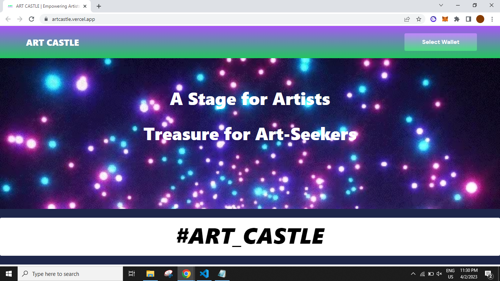
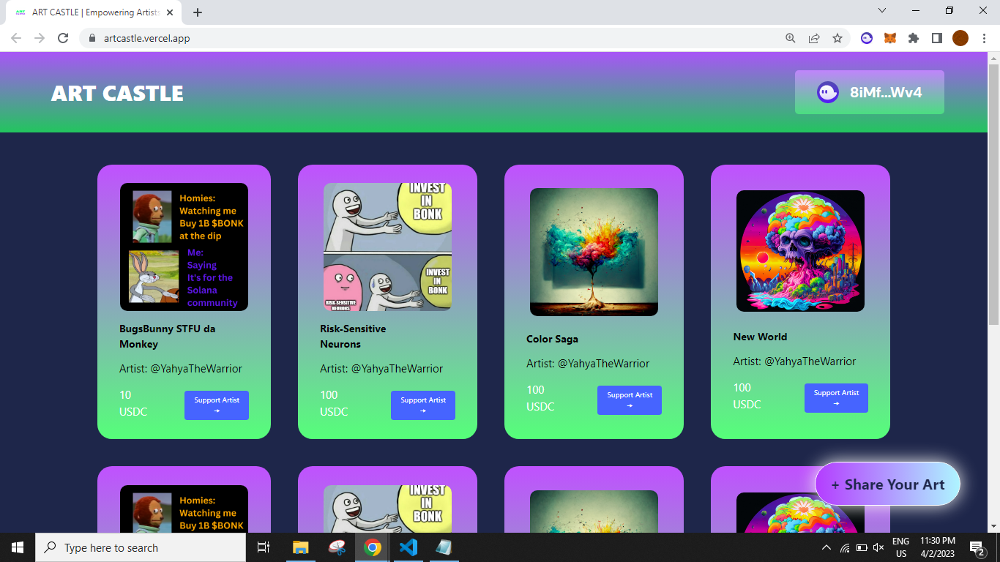
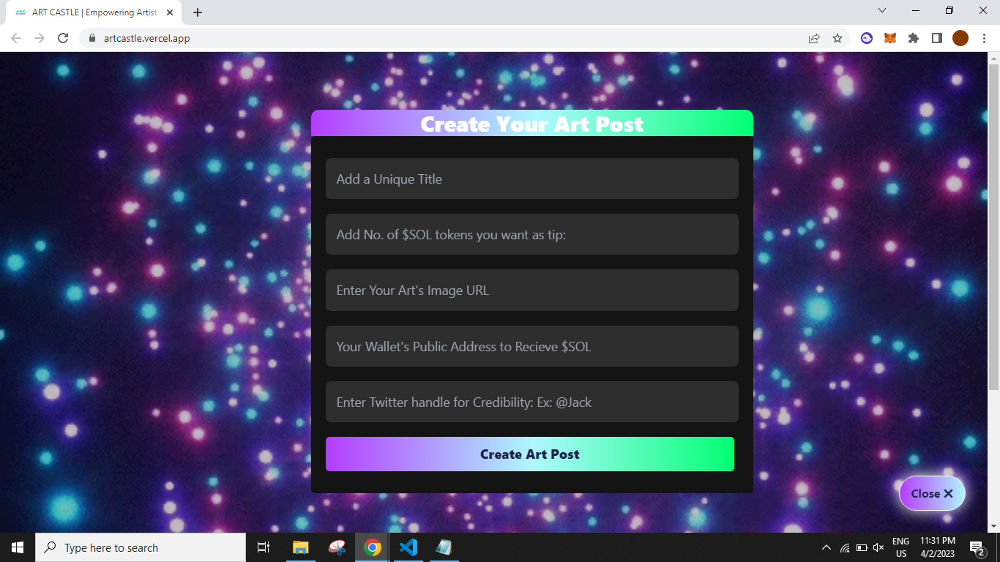
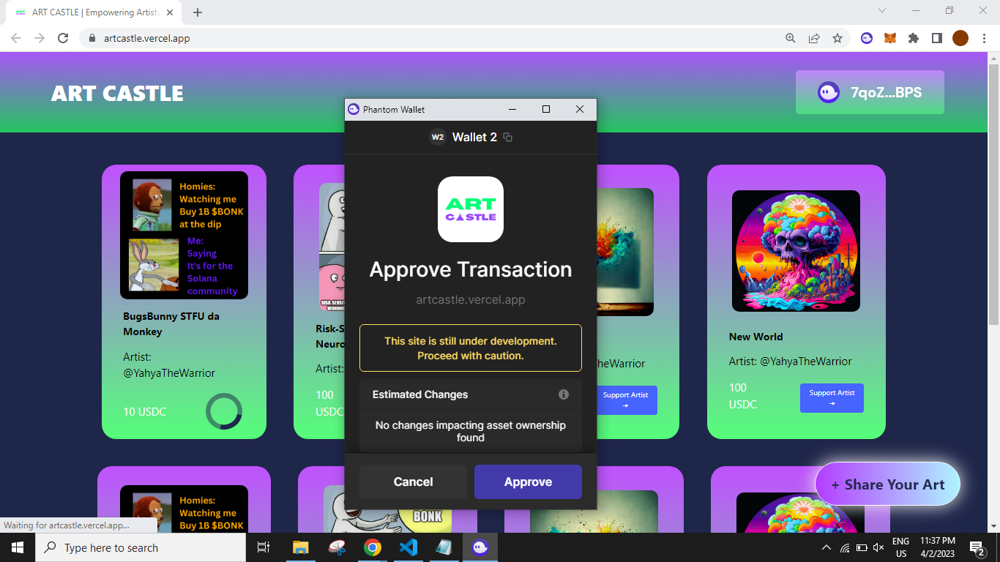

# ArtCastle
**Cross-Border payments have never been faster as with crypto and particularly Solana.
ART CASTLE gives artists a platform to post their artwork and get supported with crypto around the globe directly without any involvement of third-party.
Art-embracing users can use ART CASTLE to simply view other people's artwork while they can also support them with $USDC.**

# Video Link for the project's MVP Demo: 
**https://www.youtube.com/watch?v=K1K6mqYOJLQ**

# Tech Stack Used: 
**Solana, Solana JS SDK, Solana Pay Library, NextJS, TailwindCSS, and IPFS.**

# Tracks Covered: 
**Solana and IPFS**



## Getting Started

First, run the development server:

```bash
npm run dev
# or
yarn dev
```

Open [http://localhost:3000](http://localhost:3000) with your browser to see the result.

You can start editing the page by modifying `pages/index.js`. The page auto-updates as you edit the file.

# Some snippets of the Project:






